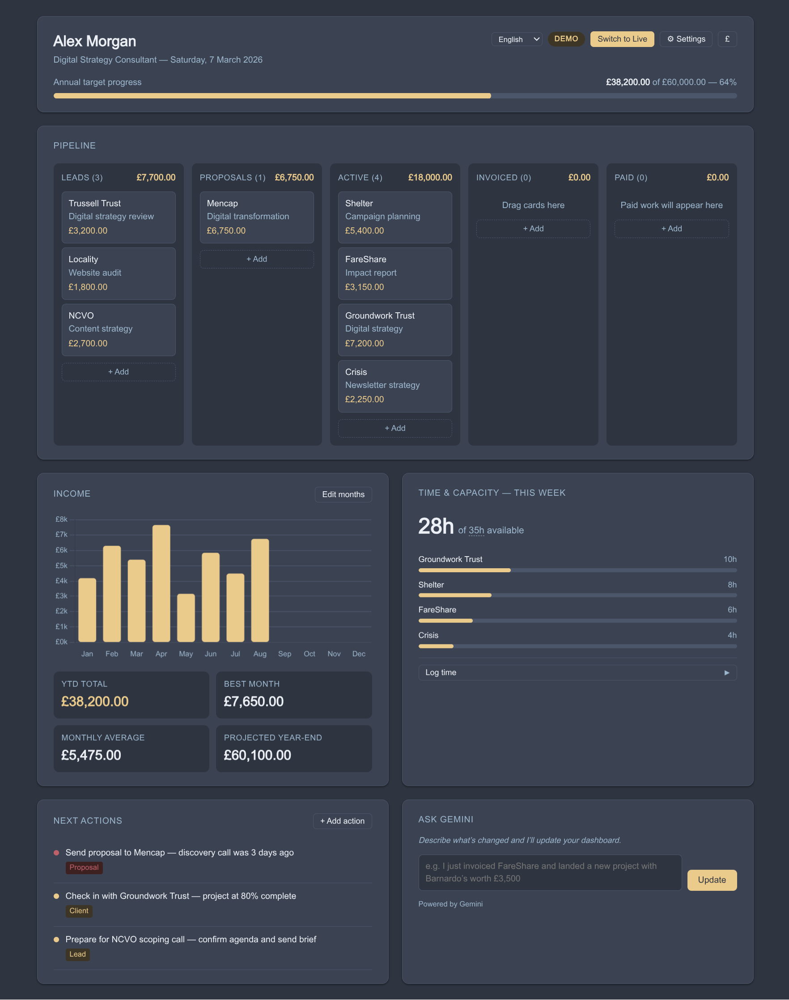

# Groundwork

**[Download the latest version](https://github.com/dynamicskillset/groundwork/releases/latest)**

A dashboard for freelancers that lives entirely on your computer. Track your leads, income, time, and to-do list — without subscriptions, accounts, or sending your data anywhere.

## What it does

- **Pipeline** — see all your work at a glance, from first conversation to getting paid. Drag jobs across columns as they progress (Lead → Proposal → Active → Invoiced → Paid).
- **Income** — a monthly bar chart showing what you've earned, your best month, and a projected year-end total based on your average.
- **Time & capacity** — log hours by client, see how your week is filling up, and keep an eye on your workload.
- **Next actions** — a simple to-do list with priority levels so you know what to tackle first.
- **Ask AI** — describe a change in plain English and the dashboard updates itself. "Moved the Acme project to invoiced" or "Logged 3 hours on the Barnardo's website" — that kind of thing. Completely optional.

## Your data stays with you

Everything is saved in your browser — there's no account, no server, and nothing leaves your computer unless you choose to use the Ask AI feature with an internet-connected AI service. The dashboard works fully offline.

## Getting started

1. Download the latest `groundwork-x.x.x.html` file from the [releases page](https://github.com/dynamicskillset/groundwork/releases/latest)
2. Open it in any web browser (Chrome, Firefox, Safari, Edge)
3. Answer a few quick setup questions (your name, currency, annual income target)
4. You're in

Take the guided tour on first load — it walks you through each section in about two minutes.

## Updating to a new version

1. In your current version, go to **Settings → Data → Export JSON** and save the backup file
2. Download the new `groundwork-x.x.x.html` and open it
3. Go to **Settings → Data → Import** and load your backup

Your data should carry over automatically in Chrome and Edge (all local files share the same storage). In Firefox it won't — each file has separate storage — so the export step is essential. When in doubt, always export first.

## Languages

The dashboard is available in English, Spanish, French, German, and Italian. Change your language in Settings. Switching language also adjusts the default currency symbol.

## Privacy toggle

Click the currency symbol in the top-right corner to hide all financial figures — handy if you're working in a coffee shop or on a video call.

## Optional: Ask AI

The "Ask AI" box lets you update your dashboard by describing what happened, rather than clicking through forms. It works with several AI services — you'll need an account and API key from whichever one you choose:

| Service | Where to sign up |
|---|---|
| Gemini (Google) | aistudio.google.com |
| Mistral | console.mistral.ai |
| Ollama | Run locally on your computer — free, no account needed |

Add your key in Settings → AI Models. If you'd rather not use AI at all, every part of the dashboard works manually — nothing is hidden behind it.

## Backing up your data

Settings → Data → Export JSON saves a full backup you can restore from at any time. You can also export your pipeline as a spreadsheet (CSV) if you want to work with it in Excel or Numbers.

## Keyboard shortcuts

Everything works with a keyboard if you prefer not to use a mouse:
- Tab through pipeline cards, then Enter or Space to open one
- Arrow keys to move sections up or down
- Escape to close any pop-up

## Licence

AGPL-3.0. If you distribute or host a modified version, you must make the source available under the same terms.

## Changelog

### v1.1.1
- Fix: pipeline projection now correctly calculates YTD + outstanding stages (Active + Invoiced), rather than a raw pipeline sum that could show less than already-earned income

### v1.1.0
- New: choose how the Projected year-end figure is calculated — monthly average extrapolation (default) or pipeline total
- Pipeline total mode lets you include or exclude Leads and Proposals; Active, Invoiced, and Paid are always counted
- Projected year-end now updates live when pipeline cards are added, edited, deleted, or dragged between columns

### v1.0.1
- Income chart now starts from the correct month based on your financial year end date
- Claude and ChatGPT integrations temporarily removed pending further testing

### v1.0
- Initial release
